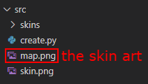
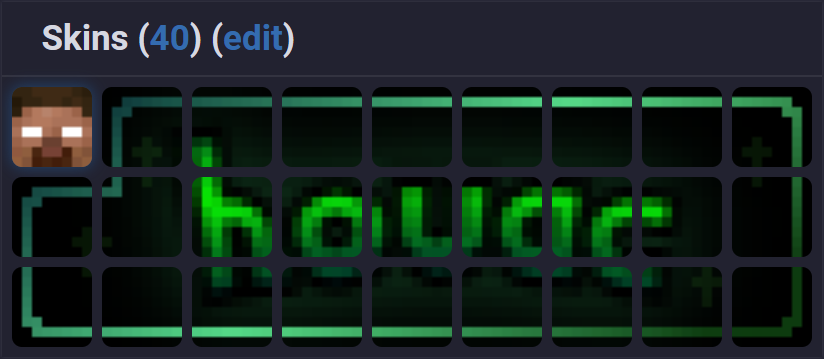

# NameMC Skinart Tool

## 📜 Description

This is a Python script that splits up a 72x24 image into 26 Minecraft skins you can use to display images on the NameMC platform.

## ⚠️ Alternatives

I started this after my friend showed off some of his skinart to me, and I wanted to make a program to help me make my own!

> [Thomas.GG](https://thomas.gg/)

If you want an easier to use version of this that doesn't require Python or anything like that, please just use Thomas' website, it's way easier.

## 🎲 How to use

### Step 1) Create your skin art

Create a 72x24 pixel image, and dont use the first 8x8 pixels.

Example:

### Step 2) Run the Python script

Save skin art as "`map.png`" in same directory as "`create.py`"

Run "`create.py`" and voila, your skinart will be processed in the "`skins`" directory.

### Step 3) Apply your skins on NameMC

Apply all the skins in the "`skins`" directory, starting from 26 to 1.

In-between each skin, apply your NameMC profile until the skin is there.

## Step 4) profit..?

How it looks on NameMC:

*the next skin you use will show at the top left corner*
